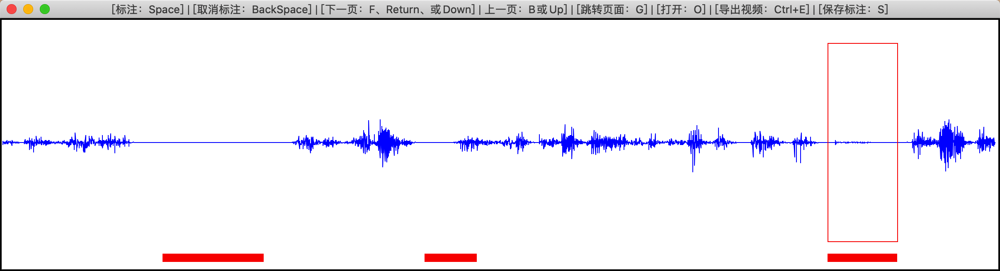

# video_clip
视频剪切小工具，标注出需要剪切的部分，导出为mp4格式.

## 依赖
- Python >= 3.6
- 如下工具包，首次运行会自动安装（由于网络问题自动安装可能失败，可手动安装）
  - numpy
  - moviepy
  - sounddevice
- 手动安装方法
  - step1:配置pip清华镜像
    - `pip config set global.index-url https://pypi.tuna.tsinghua.edu.cn/simple`
  - step2:安装工具包
    - `pip install numpy moviepy sounddevice`
  - 注意：若提示权限问题，以管理员身份运行cmd即可

## 运行
`python video_clip.py`

## 使用

- 标注：Space
- 取消标注：BackSpace
- 下一页：F、Return、或Down
- 上一页：B或Up
- 页面跳转：G
- 打开新视频：O
- 导出视频：Ctrl+E
- 保存标注：S

